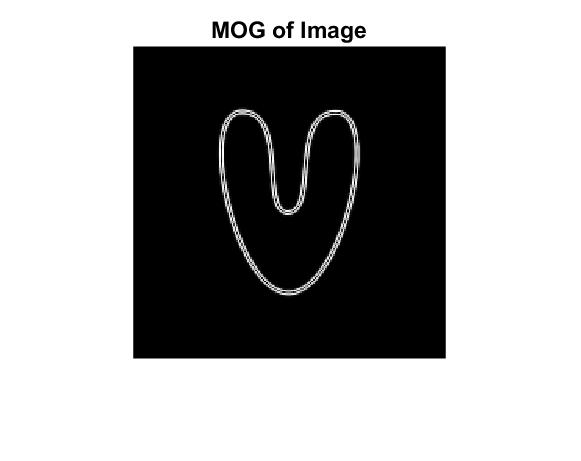
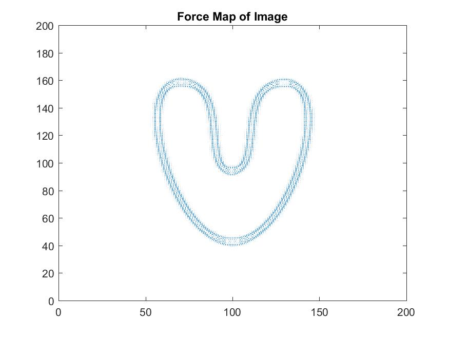

# ProjectThirdPhase(UG)
Turn-in: (1) the code for the main function that calls snakeMap4e and snakeForce4e, (2) the
code for snakeForce4e, (3) the velocity plot for [Fx,Fy] as obtained from the Emap image
produced by snakeMap4e without blurring and without thresholding, (4) the Emap image of
the MOG of the previous step, i.e., the input for the test (the third item above – the input to
the snakeForce4e).

# To run this program use:
```
>> main
```

# Expect Output of `main.m`




